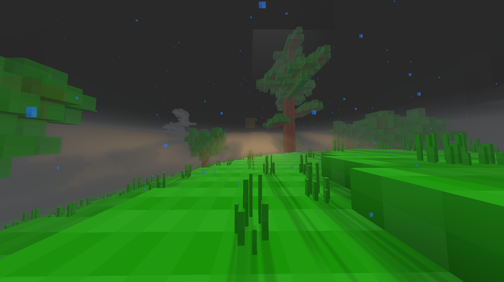

# 1042

## Overview

1042 is a game placed in Europ around the year 1042 A.D. The game focuses on PvE and adventure. At the moment it is a bit limited but still playable at the basic level (See `Features` for more.)

We Hope you enjoy playing it and all feedback is welcome!

## State: `pre-alpha-v0.1.1` **WARNING** Some systems may have problems running this game!

### Notes on this version
- Server mode is disabled due to multiplayer nuances, this will be fixed by beta v0.2.0

## Features
- Mapgen with 4 biomes (tempeture areas) vast mountins and plains with deep oceans and caves
- Unique UI with custom HUD and Invintory and in-game settings (on a per-player basis)
- 1 texture
- Several nodes
- Working weather system
- Working tools
- Ores
- Achivments API
- Some sounds
- Basic mobs (Fish and pigs, as of last update)
- Basic smelting and crafting recipies.

## Planned
- Add moddable mapgen API
- Crafting of items
- More trees and plants
- Add More sounds and music
- More general gameplay

## Roadmap

#### pre-alpha v0.1.0 to alpha v0.2.0 goals
- Add more trees and plants, flowers maybe.
- Add sounds
- Add pvp physics and more weapons (Bow and club)
- Add lootable structures

#### beta v0.2.0
- Add mapgen API

#### beta v0.3.0
- Add more structures (villages)
- Add rivers
- Possibly add new world(s)

## Settings

- `1042_warn_players_about_settings` Warns players abour the requirements for settings to be enabled if they join in servermode, default: `true`
- `1042_auto_adjust_settings` Automaticly turns on settings for player (and updates to minetest.conf) if user settings conflict, default: `false`

### NOT RECOMMENDED
- `1042_ignore_required_settings` Ignore required settings and run anyway (See Requirements), default: `false`
- `1042_disable_weather` Disable in-game weather, default: `false`

## Requirements

### Luanti
1042 has some requirements to run. There are also some things that are recommended and will be set up if settings are left to default values or if `1042_auto_adjust_settings = true`

#### Can not be overridden
- Luanti version 5.10.0 or later

#### Can be overridden with `1042_ignore_required_settings = true`
- `enable_shaders = true` for rendering some nodes properly
- `enable_auto_exposure = true` for the colours in the game to look right
- `enable_post_processing = true` for rendering
- `translucent_liquids = true` to render things like water
- `enable_clouds = true` for weather to look right
- `enable_3d_clouds = true` for weather to look right
- `exposure_compensation = 0.5` for stuff to look right

#### Recommended
- `enable_waving_water = true`
- `enable_water_reflections = true`
- `smooth_lighting = true`
- `enable_dynamic_shadows = true`
- `enable_volumetric_lighting = true`
- `enable_bloom = true`
- `enable_node_specular = true`
- `soft_clouds = true`
- `connected_glass = true`
- `enable_fog = true`

## Contributing
1042 is a free and open-source game and is licensed under the MIT license. If you would like to help develop you can make PRs on our [github](https://github.com/Xeno333/1042/). You can also join our [discord](https://discord.gg/7YTMtyPgrD).

## Online Resources
- Github `https://github.com/Xeno333/1042/`
- 1042 Discord `https://discord.gg/7YTMtyPgrD`